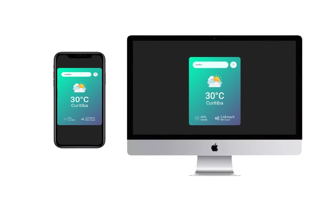

<h1 align="center">Weather Forecast</h1>

<h3 align="center">
  Let's go to know the Weather
</h3>

## 🏠 About the project

The project is a Weather Forecast in real time, using API https://openweathermap.org
 

## 🛠️ Adjustments and improvements

[X] Responsive screens  
[ ] Create Screen of Login and Register  
[ ] Create a Project Dynamic Images

## 🖥️ Technologies

[JavaScript]

## Run Project in you Navigator

https://luanrebuli.github.io/weather-ap/

## Contributors

We thank the following people who contributed to this project:

<table>
  <tr>
    <td align="center">
      <a href="#">
         
        
          <b>Luan Rebuli</b>
        
      </a>
    </td>
  </tr>
</table>

